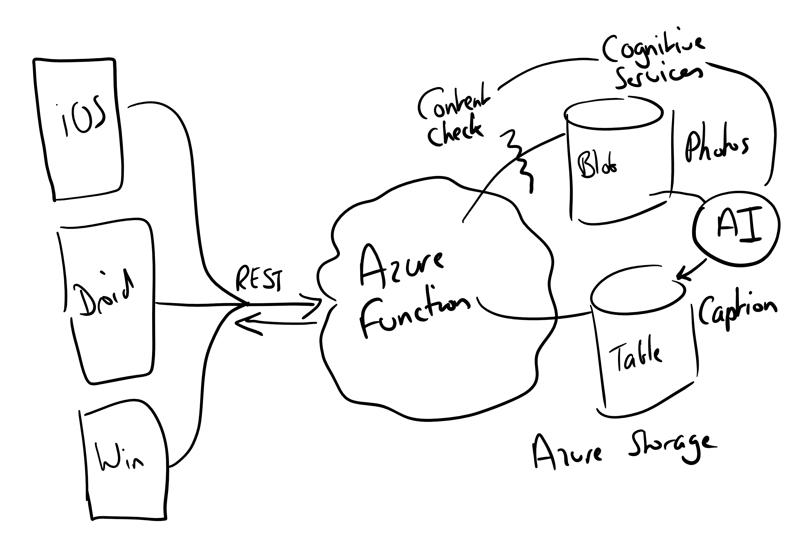
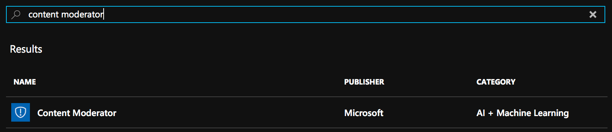
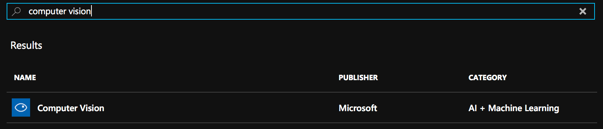
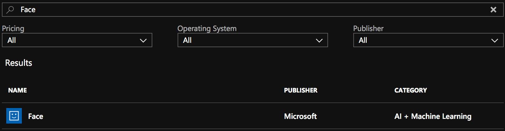
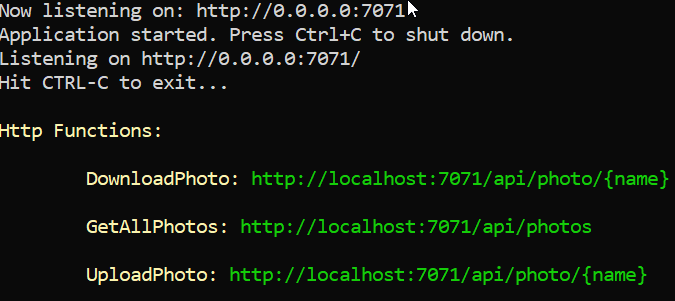
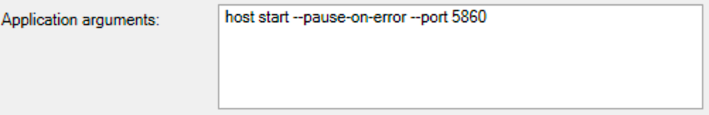
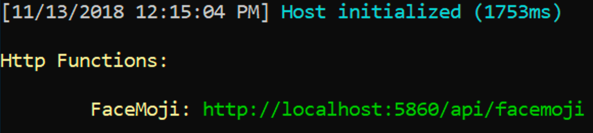
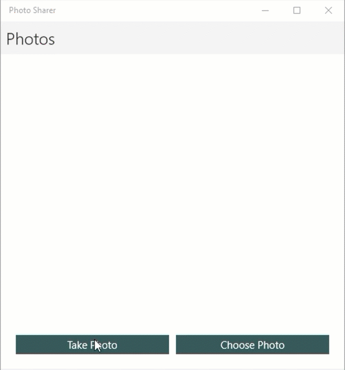
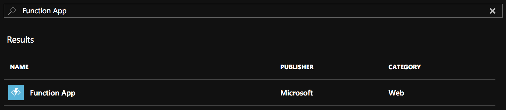
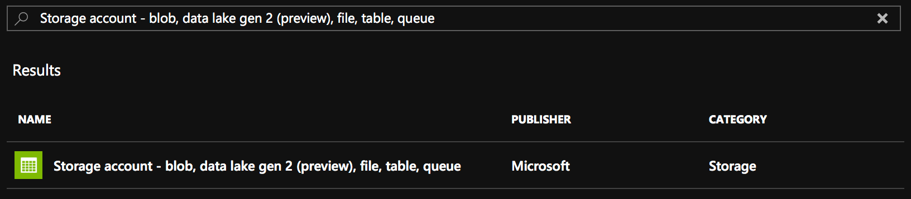

# Azure Photo Sharer

This is a sample app showing how you can build a cross-platform [Xamarin](https://visualstudio.microsoft.com/xamarin/?WT.mc_id=azurefree-github-jabenn) app that allows you to take a photo and share it with other users using Azure. This can be built using the [Azure Free Account](https://azure.microsoft.com/free/?WT.mc_id=azurefree-github-jabenn).

The back end is build using [Azure Functions](https://docs.microsoft.com/azure/azure-functions/?WT.mc_id=azurefree-github-jabenn), [Azure Storage](https://docs.microsoft.com/azure/storage/?WT.mc_id=storage-github-jabenn) and [Cognitive services](https://docs.microsoft.com/azure/cognitive-services/?WT.mc_id=azurefree-github-jabenn).

The architecture of this app is:



* The client is a Xamarin app that runs on iOS, Android and Windows
* This talks over REST to an Azure Functions app
* Photos are uploaded over the REST API. These are run through the content moderator cognitive service to look for adult content and if any is found, the call returns an error status.
* If the photo passes the content moderator, it is saved into blob storage
* Once a photo is saved into blob storage, a trigger is fired that runs the photo through the computer vision cognitive service to create a caption. This is then saved to table storage.
* The client can then download the images and captions over the REST API.
* When the images are downloaded they are 'mojified' - so any faces detected in the image are replaced with emojis showing the same emotion.

## Application structure

This app is made up of seven projects - two for the back end, four for the mobile app and one that is shared.

### Back end

* `AzurePhotoSharer.Functions` - This is an Azure Functions V2 project built using C#, containing the main back end. This consists of a number of HTTP triggers that exposes a REST endpoint, and a blob storage trigger.
* `AzurePhotoSharer.FSharp.Functions` - This is an Azure Functions V1 project built using F# that has a single HTTP trigger to 'mojify' an image.

### Mobile app

* `AzurePhotoSharer` - This is a Xamarin.Forms .NET standard project containing all the UI and ap logic for the mobile app.
* `AzurephotoSharer.Android` - The Android app project for the Xamarin.Forms app.
* `AzurephotoSharer.iOS` - The iOS app project for the Xamarin.Forms app.
* `AzurephotoSharer.UWP` - The UWP app project for the Xamarin.Forms app.

### Shared code

* `AzurePhotoSharer.Shared` - This project contains a data type that is shared by both the front and back end.

## To get started

You will need to register for an Azure free account here: [azure.microsoft.com/free](https://azure.microsoft.com/free/?WT.mc_id=azurefree-github-jabenn).

> __NOTE__
>
> When creating resources you should use the same Resource Group for them all to make it easier to clean them up later.

* From the [Azure portal](https://portal.azure.com/?WT.mc_id=azurefree-github-jabenn), create a new __Content Moderation__ resource using the F0 free tier.
  

* Create a new __Computer Vision__ resource, again using the F0 free tier.
  

* Create a new __Face__ resource, again using the F0 free tier.
  

* Get API keys for all of these services. Add the content moderation and computer vision keys to the `local.settings.json` file in the `AzurePhotoSharer.Functions` project.

  ```json
  {
    ...
    "Values": {
      ...
      "ContentModeratorKey": "<Your content moderator API key>",
      "ComputerVisionKey": "<Your computer vision API key>"
    }
  }
  ```

  * Add the Face key to the `local.settings.json` file in the `AzurePhotoSharer.FSharp.Functions` project.

  ```json
  {
    ...
    "Values": {
      ...
      "EmotionApiKey": "<Your Face API key>"
    }
  }
  ```

  * Update the endpoints in the `PhotoManager.cs` file in the `AzurePhotoSharer.Functions` project if necessary.

  ```cs
  readonly static ContentModeratorClient ContentModeratorClient =
        new ContentModeratorClient(new ApiKeyServiceClientCredentials(Environment.GetEnvironmentVariable("ContentModeratorKey")))
    {
        Endpoint = "https://westeurope.api.cognitive.microsoft.com/" // Update this if necessary
    };

  readonly static ComputerVisionClient ComputerVisionClient =
        new ComputerVisionClient(new ApiKeyServiceClientCredentials(Environment.GetEnvironmentVariable("ComputerVisionKey")))
    {
        Endpoint = "https://westeurope.api.cognitive.microsoft.com/" // Update this if necessary
    };
  ```

  * Update the endpoint in the `FaceMoji.fs` file in in the `AzurePhotoSharer.FSharp.Functions` project if necessary.

  ```fsharp
  let faceClient =
        let fc = new FaceClient(apiKeyCredentials)
        fc.Endpoint <- "https://westeurope.api.cognitive.microsoft.com" // Update this if necessary
        fc
  ```

## Running the service locally on Windows

* Install the [Azure Storage Emulator](https://docs.microsoft.com/azure/storage/common/storage-use-emulator/?WT.mc_id=azurefree-github-jabenn) and launch it
* Start the `AzurePhotoSharer.Functions` project without debugging.
  
  

* Share the `AzurePhotoSharer.FSharp.Functions` project without debugging.
  __NOTE__ - by default, this project will try to run listening on the same port as the `AzurePhotoSharer.Functions` project. You will need to configure this to run on a different port. To do this, right-click on the `AzurePhotoSharer.FSharp.Functions` project in the solution explorer and select _Properties_. From the __Debug__ tab, set the _Application arguments_ to be:

  ```sh
  host start --pause-on-error --port 5860
  ```

  

  Then start the app without debugging. The port it will use is 5860, and the `AzurePhotoSharer.Functions` project is already pre-configured to use this port.

  

* Set the `AzurePhotoSharer.UWP` project as the startup project and run it. It will connect to the local Azure Functions runtime and allow you to take or choose photos and upload these to local storage. You will see the images that are uploaded, along with their captions. If you upload any racy images you will see an error.

  

  You won't be able to use the iOS and Android apps at the moment as they can't be default point to 'localhost'. You will only be able to test these once this app has been deployed to Azure.

## Running the service from Azure

* From the [Azure portal](https://portal.azure.com/?WT.mc_id=azurefree-github-jabenn), create a new __Function App__.
  

* Create a new __Storage account - blob, data lake gen 2 (preview), file, table, queue__ resource.

  

* Deploy both functions apps from Visual Studio to this Function App, either by [publishing directly form inside Visual Studio](https://docs.microsoft.com/azure/azure-functions/functions-develop-vs/?WT.mc_id=azurefree-github-jabenn), or by using the [__Deployment Center__](https://docs.microsoft.com/azure/azure-functions/functions-continuous-deployment/?WT.mc_id=azurefree-github-jabenn). Publishing from Visual Studio should never be used for production code.

  

* Configure the [application settings](https://docs.microsoft.com/azure/azure-functions/functions-how-to-use-azure-function-app-settings/?WT.mc_id=azurefree-github-jabenn) for both Functions app. 
  Set the following fields for the `AzurePhotoSharer.Functions` app:
  
  * `MojifierUrl` - set this to the URL for the published `AzurePhotoSharer.FSharp.Functions` project
  * `ContentModeratorKey` - set this to the API key for your content moderator resource
  * `ComputerVisionKey` - set this to the API key for your computer vision resource
  * `StorageConnectionString` - set this to a connection string for your storage resource

  Set the following fields for the `AzurePhotoSharer.FSharp.Functions` app:
  
  * `EmotionApiKey` - set this to the API key for your Face resource

* Configure the app to point to your new Function app by updating the `AzureAppName` constant in the `AzureServiceBase.cs` file in the `AzurePhotoSharing` project to match the name of your app. Set the `FunctionAppUrl` constant to be the full URL of your app by commenting out the `localhost` version and uncommenting the full URL.

  ```cs
  protected const string AzureAppName = "<Your app name>"; // Update this to your app name
  protected readonly static string FunctionAppUrl = $"https://{AzureAppName}.azurewebsites.net"; // Uncomment this line
  //protected const string FunctionAppUrl = $"http://localhost:7071";   // Comment this line out
  ```

* Run the app. It will now use Azure for the back end and storage and will run on all platforms.

## Adding authentication

This app is configured to use authentication, it just needs to be turned on in the app and enabled on the Function App.

* Function app authentication can be using a number of different accounts. The mobile app is configured to authenticate using a Microsoft account. Configure the authentication according to the [docs](https://docs.microsoft.com/azure/app-service/app-service-mobile-how-to-configure-microsoft-authentication/?WT.mc_id=azurefree-github-jabenn).
* Set the __Allowed External Redirect URLs__ setting to be `azurephotosharer://easyauth.callback`. This matches the URL scheme already configured in the mobile app.
* In the `AzureServiceBase.cs` file in the `AzurePhotoSharer` project, locate the `IsLoggedIn` method. Delete the `return true;` statement and uncomment the remaining lines.

  ```cs
  public async Task<bool> IsLoggedIn()
  {
      await TryLoadUserDetails();
      return Client.CurrentUser != null;
  }
  ```

* Launch the app. You will now need to log in.

<hr/>

If you want a more detailed overview of a similar kind of app, check out this workshop: https://github.com/jimbobbennett/MobileAppsOfTomorrow-Lab